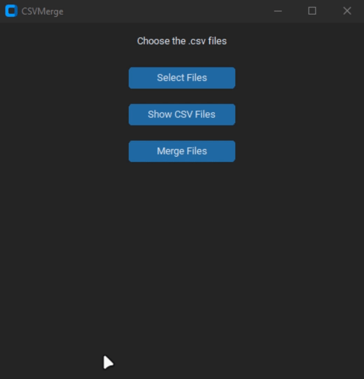
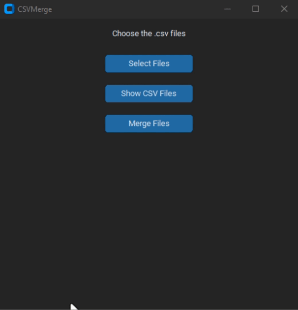

# CSVMerge

É uma aplicação em Python que permite a seleção de arquivos CSV, conversão para UTF-8 e a concatenação horizontal desses arquivos, mantendo todas as colunas.

## Requisitos

Certifique-se de ter as bibliotecas necessárias instaladas. Você pode instalá-las usando o seguinte comando:

```bash
pip install -r requirements.txt
```
## Bibliotecas Utilizadas
- customtkinter (0.1.0): Biblioteca customizada para melhorar a aparência de interfaces gráficas no Tkinter.
- pandas (1.3.3): Biblioteca para manipulação e análise de dados.
- chardet (4.0.0): Biblioteca para detectar a codificação de um arquivo.
## Utilização
Execute o arquivo main.py.
Uma janela será aberta com três botões: "Select Files", "Exibir CSV Files" e "Merge Files".
1. Select Files
Clique no botão "Select Files" para abrir uma janela de seleção de arquivos. Selecione os arquivos CSV que deseja concatenar. A lista de arquivos selecionados será exibida em uma caixa de mensagem.


2. Exibir CSV Files
Clique no botão "Exibir CSV Files" para visualizar todos os caminhos dos arquivos CSV que foram selecionados.


3. Merge Files
Clique no botão "Merge Files" para iniciar o processo de concatenação dos arquivos CSV. O resultado será salvo como "MergedCSV.csv" no mesmo diretório do script.
Lembre-se de que os arquivos CSV serão convertidos para UTF-8 antes da concatenação.


## Observações
Certifique-se de ter todos os arquivos CSV a serem concatenados na mesma pasta.
Os arquivos temporários UTF-8 gerados durante o processo serão excluídos após a concatenação.

Aproveite a facilidade de usar o CSVMerge para processar e unir seus arquivos CSV de maneira eficiente!
